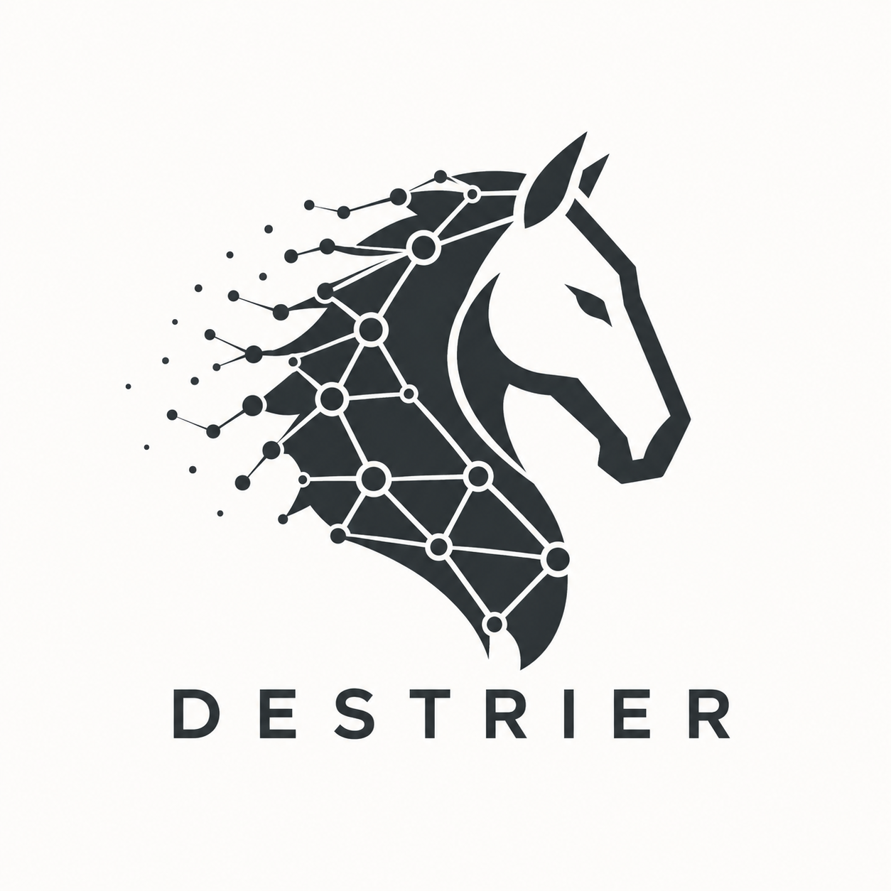

<div align="center">
  
</div>

# destrier

> The warhorse that carries your code into battle — armored review, debugging, and a durable knowledgebase that does the heavy lifting.

A generic **code-improvement toolkit for Claude Code**, packaged as a plugin:
battle-tested skills, git hooks, a durable knowledgebase, code-graph + flow
metrics, and an opt-in Spec-Driven Development loop. Upstream tools are
**bootstrapped from source, never vendored** — see [Built on](#built-on).

## Contents

- [Install](#install)
- [What it bundles](#what-it-bundles)
- [Commands](#commands)
- [External tools](#external-tools-bootstrapped-not-vendored)
- [Spec-Driven Development](#spec-driven-development-opt-in)
- [Requirements](#requirements)
- [Privacy](#privacy)
- [Development](#development)
- [Built on](#built-on)
- [License](#license)

## Install

destrier is its own Claude Code marketplace — one command each:

```text
/plugin marketplace add dbrami/destrier
/plugin install destrier
/destrier-setup
```

`/plugin install` loads the skills, hooks, commands, and gitnexus MCP
registration. `/destrier-setup` bootstraps the external tools; restart Claude Code
afterward so the MCP server loads.

## What it bundles

| Component | Type | Purpose |
|-----------|------|---------|
| `evidence-driven-debugging` | skill | Evidence-over-deduction habits for any debugging task. |
| `session-handover` | skill | A durable, model-labeled knowledgebase across sessions as a strict [Open Knowledge Format](https://github.com/GoogleCloudPlatform/knowledge-catalog/blob/main/okf/SPEC.md) (OKF) v0.1 bundle. |
| `spec-driven-brainstorming` | skill | Make brainstorming the front-end for `/speckit-constitution` and `/speckit-specify`. |
| `daily-recap` | SessionStart hook | Recap of last-24h commits, uncommitted changes, unpushed counts. |
| `commit-hygiene` | Stop hook | Warns about stale CLAUDE.md/README, missing version bump, unpushed commits. |
| `critical-path-precommit` | script | Prompts gitnexus impact analysis when staged files match critical paths. |
| `flow-metrics` | script | Weekly throughput + cycle-time (p50/p85) and WIP-aging via `gh`. |
| `security-scan` | script | De-identification + secret scan, reused by the security-review gate. |
| `spec-kit-ext` | spec-kit extension | Bridges the SDD loop into the OKF knowledgebase, GitHub issues, and flow-metrics (opt-in). |

## Commands

| Command | What it does |
|---------|--------------|
| `/destrier-setup` | Build gitnexus from git and install roborev via its official installer. |
| `/destrier-spec-init` | Opt-in: set up Spec-Driven Development (spec-kit) in the current repo. |
| `/destrier-kb-init` | Initialize today's KB session summary (OKF v0.1) and show recent ones. |
| `/destrier-precommit-install` | Install the critical-path guard as this repo's pre-commit hook. |
| `/destrier-security-review` | De-identification + secret scan of pending changes (plus roborev when available). |
| `/destrier-flow-metrics` | Throughput and cycle-time report for one or more repos. |

## External tools (bootstrapped, not vendored)

`/destrier-setup` installs both into `~/.destrier/vendor/`:

- **[gitnexus](https://github.com/abhigyanpatwari/GitNexus)** — cloned and built
  (`npm install && npm run build`; needs Node + git), registered as an MCP server.
  Fallback: `npm install -g gitnexus`. Run `gitnexus analyze` once per repo.
- **[roborev](https://roborev.io)** — official installer (`curl … | bash`, prebuilt
  binary), then `roborev init` + `roborev skills install`.

> The roborev installer is `curl | bash` — user-invoked and pinned to the official
> URL. Review it first if you prefer.

## Spec-Driven Development (opt-in)

Bring GitHub [spec-kit](https://github.com/github/spec-kit)'s SDD loop —
`constitution → specify → plan → tasks → implement` — into a repo with
`/destrier-spec-init` (opt-in, per-repo).

destrier **bootstraps** the `specify` CLI and integrates via spec-kit's
**extension-hook API**, never forking a command, so `specify self upgrade` keeps
working. Three optional, prompted bridges:

- **after `/speckit-specify`** → create one structured GitHub issue from the spec
  (issue-first). Default **links + summarizes** the spec (`spec.md` stays
  canonical); per-repo `.destrier/issue.config` sets labels/project/body-mode/etc.
  The de-identification gate runs before publishing; idempotent.
- **after `/speckit-plan`** → a **link-only** OKF knowledgebase concept pointing at
  `plan.md` (never a copy).
- **after `/speckit-taskstoissues`** → `flow-metrics` over the resulting issues.

The **`spec-driven-brainstorming`** skill makes brainstorming the front-end for
authoring: brainstorm → distill → `/speckit-constitution` or `/speckit-specify`.
Seed the constitution from `templates/destrier-constitution-values.md` (input, not
a replacement).

Needs `uv` + `python3 >= 3.11`. Pinned to `specify v0.11.6`; any `0.11.x` is
accepted (the extension's `>=0.11,<0.12` range) — upgrade via
`specify self upgrade --tag`. **Set `DESTRIER_PRIVATE_DENYLIST` before authoring
specs** (spec text is committed and scanned). For a shell/markdown plugin,
`data-model.md`/`contracts/`/`quickstart.md` are N/A.

## Requirements

`git`, `rg`, `jq` (core); Node + npm (gitnexus); `python3` + `gh` (flow-metrics);
`curl` (roborev); `uv` + `python3 >= 3.11` (SDD). `/destrier-setup` verifies all
and prints install commands; `bash scripts/bootstrap.sh --install-deps` installs
the missing ones (brew/apt/dnf/yum), `--check` just reports.

## Privacy

destrier ships **no** personal content. A generic denylist
(`templates/identifying-tokens.denylist`) flags structural leaks (home paths,
secrets); add your own codenames to a gitignored file via `DESTRIER_PRIVATE_DENYLIST`.

## Development

```bash
bash test/run.sh                          # run the test suite
bash scripts/security-scan.sh --tree .    # de-identification + secret scan
```

Every commit passes the security scan before it lands; see `docs/design/`.

## Built on

A thin, credited layer over open-source work — bootstrapped, not vendored:

- **[spec-kit](https://github.com/github/spec-kit)** (GitHub) — Spec-Driven
  Development toolkit (`specify` CLI + extension API).
- **[gitnexus](https://github.com/abhigyanpatwari/GitNexus)** (Abhigyan Patwari) —
  code knowledge graph + MCP.
- **[roborev](https://roborev.io)** — multi-agent AI code review.
- **[superpowers](https://github.com/obra/superpowers)** (Jesse Vincent) — the
  `brainstorming` skill behind `spec-driven-brainstorming`.
- **[Open Knowledge Format](https://github.com/GoogleCloudPlatform/knowledge-catalog/blob/main/okf/SPEC.md)**
  (Google Cloud) — the `session-handover` KB is a strict OKF v0.1 bundle.
- **[uv](https://github.com/astral-sh/uv)** (Astral) — installs the pinned spec-kit CLI.
- **[Claude Code](https://claude.com/claude-code)** (Anthropic) — the host platform.

Each is independently maintained; review upstream source before installing what
destrier bootstraps.

## License

MIT — see [LICENSE](LICENSE).
